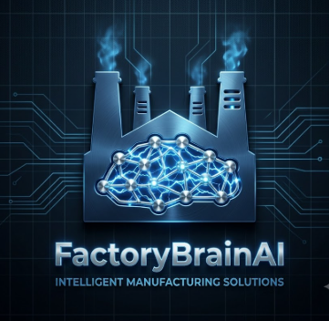

<div align="center">
  
</div>

<div align="center">


### ET HACKATHON PROBLEM STATEMENT 8
### TEAM NAME- Aayushi_sanika
### TEAM MEMBER : AAYUSHI JHA 

[](https://github.com/aayushijha0907/FactoryBrainAI-ET-Hackathon/stargazers)
[](https://github.com/aayushijha0907/FactoryBrainAI-ET-Hackathon/forks)
[](https://github.com/aayushijha0907/FactoryBrainAI-ET-Hackathon/issues)
[](https://github.com/aayushijha0907/FactoryBrainAI-ET-Hackathon/blob/main/LICENSE)
</div>


---

#  Overview
## 📖 The Problem Statement 

ET HACKATHON PROBLEM STATEMENT 8- 
Industrial organizations store critical information across thousands of disconnected documents, including maintenance records, safety procedures, engineering drawings, inspection reports, and operational manuals. This fragmented knowledge makes it difficult for engineers to quickly access accurate information, leading to increased downtime, repeated failures, compliance challenges, and loss of institutional knowledge. This project aims to build an AI-powered platform that unifies industrial knowledge, enabling intelligent document search, contextual question answering, maintenance insights, and compliance support through a single interface.

## 🚧 The Challenge

Large industrial organizations generate thousands of documents, including maintenance logs, safety manuals, inspection reports, engineering drawings, and operating procedures. These documents are often spread across multiple systems, making it difficult to locate the right information when it's needed most.

This fragmentation leads to:
-  Time-consuming document searches
-  Increased equipment downtime
-  Repeated maintenance failures
-  Compliance and audit challenges
-  Loss of valuable organizational knowledge

## 💡 Our Solution

FactoryBrain AI leverages **Generative AI**, **RAG (Retrieval-Augmented Generation)**, **Knowledge Graphs**, and **Document Intelligence** to create a centralized industrial knowledge platform.

Our solution enables users to:
-  Ask natural language questions about industrial documents
-  Receive accurate, citation-backed answers
-  Instantly search across multiple document types
-  Generate maintenance insights and root cause analysis
-  Identify compliance gaps and missing documentation
-  Visualize relationships between assets, documents, and procedures through a knowledge graph

By turning fragmented information into actionable intelligence, FactoryBrain AI empowers organizations to make faster, smarter, and more informed operational decisions.


---

## 📂 Project Structure

```
FactoryBrainAI/
│
├── 📄 README.md
├── 📄 LICENSE
├── 📄 requirements.txt
├── 📄 .gitignore
├── 📄 .env.example
│
├── 📂 app/
│   ├── __init__.py
│   ├── main.py
│   ├── config.py
│   └── constants.py
│
├── 📂 frontend/
│   ├── home.py
│   ├── chat.py
│   ├── upload.py
│   ├── dashboard.py
│   └── graph_view.py
│
├── 📂 backend/
│   ├── rag.py
│   ├── embeddings.py
│   ├── vectorstore.py
│   ├── retriever.py
│   ├── llm.py
│   └── prompts.py
│
├── 📂 agents/
│   ├── document_agent.py
│   ├── compliance_agent.py
│   ├── maintenance_agent.py
│   ├── graph_agent.py
│   └── orchestrator.py
│
├── 📂 document_processing/
│   ├── pdf_parser.py
│   ├── ocr.py
│   ├── chunking.py
│   ├── metadata.py
│   └── extractor.py
│
├── 📂 knowledge_graph/
│   ├── graph_builder.py
│   ├── entity_extraction.py
│   └── visualization.py
│
├── 📂 database/
│   ├── chromadb_manager.py
│   └── history.py
│
├── 📂 utils/
│   ├── helpers.py
│   ├── logger.py
│   └── validators.py
│
├── 📂 assets/
│   ├── logo.png
│   ├── architecture.png
│   └── screenshots/
│
├── 📂 sample_documents/
│   ├── pump_manual.pdf
│   ├── inspection_report.pdf
│   └── safety_sop.pdf
│
└── 📂 tests/
    ├── test_rag.py
    ├── test_agents.py
    └── test_parser.py

```


---

## 🚀 Tech Stack
<p align="center">
  
  
  
  
</p>

<p align="center">
  
  
  
</p>
---

## ⚙️ Installation

```bash
# Clone the repository
git clone https://github.com/aayushijha0907/FactoryBrainAI-ET-Hackathon.git
cd FactoryBrainAI-ET-Hackathon

# Install dependencies
pip install -r requirements.txt
```


```bash
# Start development server
python main.py
```

---

## 🧠 AI Features
- Model Architecture
- Training Process
- Dataset details

---

## 🚀 Usage
Explain how to run or use the project.
```bash
python main.py
```

---

## 🤝 Contributing
Contributions are welcome! Please feel free to submit a Pull Request.

---

## 👥 Contributors

<table>
  <tr>
    <td align="center">
      <a href="https://github.com/aayushijha0907">
        <br>
        <sub><b>Aayushi Jha</b></sub>
      </a>
    </tr>
    </td>
</table>


---

## 📄 License
This project is licensed under the MIT License.

---

<div align="center">

---

⭐ Star this repo if you like it!  
Made with ❤️ by [aayushijha0907](https://github.com/aayushijha0907) and [SanikaChandratre](https://github.com/SanikaChandratre)


</div>
